# Intro to Deep Learning

- Describe why deep learning is so popular.
- Explain how neural networks work at a high level.

---

# Intro to Deep Learning

Deep learning is a subset of machine learning that has become increasingly popular in recent years due to its performance along with improved computer speed, memory, and power.

There are many types of artificial neural networks including feed-foward and convolutional, and recurrent. In general, artificial neural networks have an input layer to take in each of your features, some number of hidden layers, and an output layer.

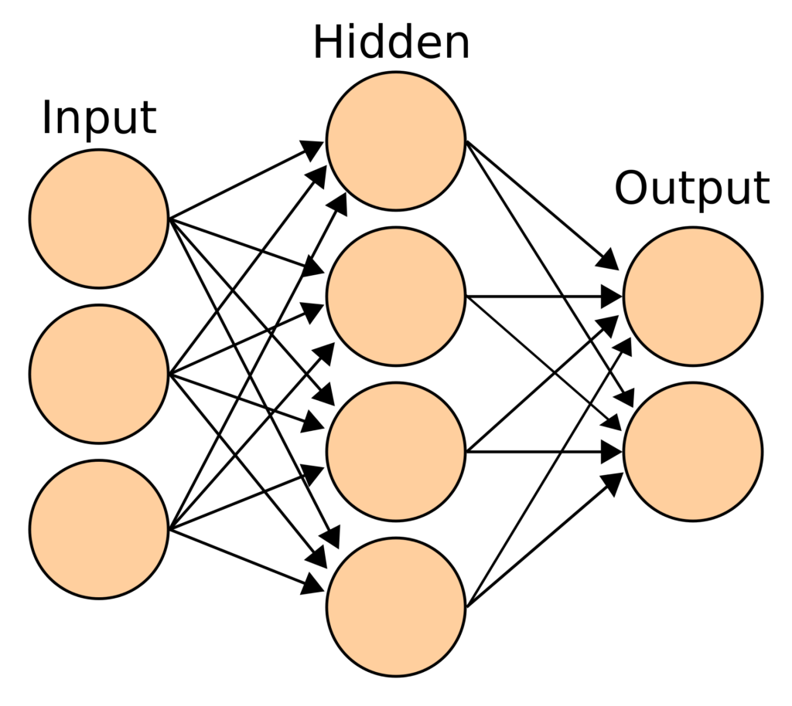

They can be used for both regression and classififcation and work very well on big data.

## How Neural Networks are Fit

In a forward pass of a neural network, we run our data through a number of layers, each consisting of a number of neural network works through this process:

    1. Take our inputs and multiply each input by a weight.
    2. Add the results from step 1 together.
    3. Add a value (called bias) to the result from step 2.
    4. Pass the result from step 3 through an activation function.
    5. The result from step 4 is then passed to the next layer, where the process is repeated.

The weights and biases are then updated through a process called backpropagation. Since this relies heavily on calculus, we will not dive into it in too much detail, but it is important to understand at a high level. Check out the optional resources at the end of this chapter if you would like to dive deeper into this. (Zach you need too!!!)

Just like in any machine learning algorithm, we are trying to minimize a loss function. In the case of neral networks, we are trying to find the values for weights and biases that minimize the loss function.

A complete forward and backward pass of all of our data points is called one epoch. The more epochs we train our model for, the better job our model will do at learning the weights and biases that minimize the loss function for our training data.

It is important to be aware of overfitting, a common porblem for neural networks.

It is up to you to decide how many neurons and layers you use in your neural network. You can play around with what this will look like and visualize the training process of a neural network .

---

# Forward Propagation

Learning Objectives:

    - Explain forward propagation and its role in deep learning.

Vocab:

    - **Node**: one unit that processes incoming information and produces a single output number

    - **Layer**: a collection of nodes working in parallel

    - **Input Layer**: the first set of nodes that work on the features of the input sample

    - **Output Layer**: the last set of nodes that output a prediction

    - **Forward Propagation**: the processing and passing of information forward through all layers to produce an output prediction

    - **Cost Function**: the difference between the predictions of all samples and their true labels

    - **Backward Propagation**: the process of updating the weights of each node to reduce the cost function

---

# Introduction

Sequential models pass information from one layer of nodes to the next some number of times until they produce an output. These are also sometimes called feed-forward networks.

There are many kinds of sequential networks that pass information through different kinds of layers. What makes them sequential is that information is passed and transformed in one direction from input ultimately to output. This is called forward propagation.

The first kind of model we will learn about is called a densely connected network, or dense network. In a dense network each node in one layer passes its output to all nodes in the next layer, as is visualized below.

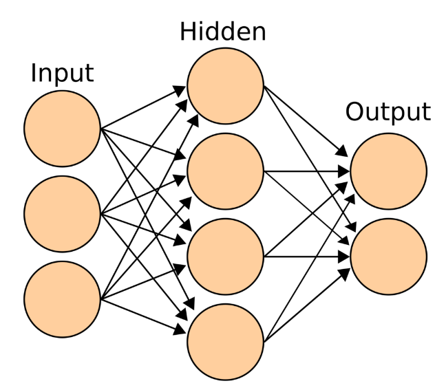

One way to think about each node in a dense network is as a separate linear regression model with an additional activation function applied to the output. Actually, you’ve already seen something like this, a logistic regression! A logistic regression is a linear regression model with a sigmoid function applied to the output.

# Refresher on Linear Regression:
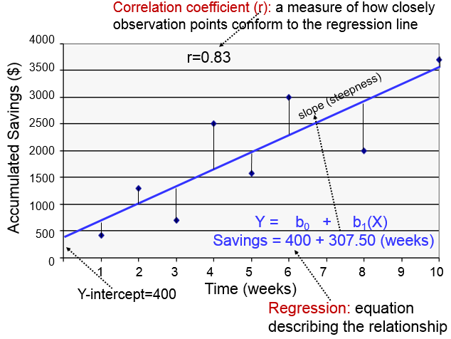

[Image Source](https://sphweb.bumc.bu.edu/otlt/MPH-Modules/PH717-QuantCore/PH717-Module9-Correlation-Regression/PH717-Module9-Correlation-Regression7.html)

A linear regression algorithm finds a best fit line to describe the function of one or more X inputs to the y output or target. It does this by multiplying each x input feature by a learned coefficient. In deep learning we call these coefficients weights. The products of the inputs and the weights are added up along with an intercept, which is called a bias in deep learning.

# Activation Functions

Each node applies an activation function to the sum of the products of the inputs and the weights and the bias term. There are a variety of activation functions that a machine learning engineer can try and each layer can have a different activation function. Some examples are: linear, sigmoid, hyperbolic tangent (tanh) and Rectified Linear Unit (ReLU).

---

# Layers

A layer is multiple nodes that each learn their own weights and biases to apply to input data. The nodes in a layer work in parallel and do not pass information to each other directly. After applying an activation function chosen by the creator, each node in one layer passes their output to every node in the next layer. The outputs of the previous layer become the inputs to the next layer.

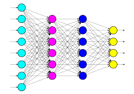

[Image source](https://deeplizard.com/learn/video/FK77zZxaBoI)

# Input layer

The nodes in the first layer, called the input layer, each receive a copy of the input data features. Each node has different weights that it applies to each feature and a different bias to add when they are summed. However, each node in a layer uses the same activation function.


# Hidden Layers

Between the input layer and the output layer is any number of hidden layers, each with their own collection of nodes. The inputs of each of the nodes in these layers are the outputs of all of the nodes in the previous layer. If the input layer has 10 nodes, each node of the first hidden layer will have 10 weights to apply to the outputs of each of the nodes in the input layer.


# Output Layer

The output layer is the last set of nodes to be applied. Their output of this layer is the output of the whole network. Because of this, the output layer has a special number of nodes and a special activation function depending on the type of machine learning problem. The number of nodes in the output layer determines how many outputs the network produces and the activation function determines what kind of output the network produces.


For example:

    1. If a single continuous number is the appropriate output, the output layer would have one node and use a linear activation function.
    2. On the other hand, if two outputs were desired and they should each be a 0 or a 1, the output layer would have two nodes and the activation function would be sigmoid.

Easy rules for output layer activation functions:

    1. Regression: use linear function
    1. Binary classification: use sigmoid
    1. Multi-class classification: use softmax

# Determining the Cost Function:

In the process of training, or fitting, which is to say finding the correct weights for each node in each layer, the network will attempt to predict a target many times. Each time it performs a forward propagation step and produces an output, that output will be compared to the true label for that sample. The difference between the network output and the true label is the error and the errors of all samples is called the cost function.

---

# Backward Propagation

Once predictions have been made on one or more samples the errors, collectively called the cost function, are then used to update the weights in each layer to prepare for the next forward propagation step. The process of updating the weights is called the backward propagation step. Backward propagation tries to reduce the cost function to produce more accurate predictions.

# Epoch

The process of completing one forward propagation step on each sample in the training set and updating the weights of each node with backward propagation is called an Epoch.

---

# Activation Functions

Learning Objectives:

    - Explain how activation functions are used.
    - Demonstrate the ability to differentiate between common activation functions.

---

# Why Use Activation Functions?

During forward propagation, after the inputs to each node are multiplied by the nodes weights for those inputs and they are summed together with the bias, the node applies an activation function before sending its output to the next layer.

Activation functions are important because they can create non-linear functions to predict classes or values. Without an activation function a node is essentially a linear regression algorithm. A linear regression can only apply a linear function to a set of inputs. If the problem cannot be modeled with a straight line, a linear regression cannot effectively model it.


[Image source](https://simple.wikipedia.org/wiki/Linear_regression)

Activation functions make the outputs of the nodes non-linear. This allows deep learning models to find non-linear solutions to complex problems.

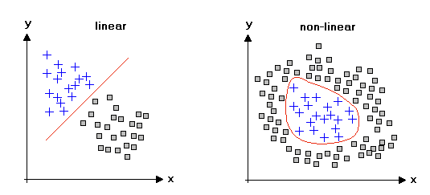

[Image Source](https://studymachinelearning.com/activation-functions-in-neural-network/)

---

# Common Activation Functions

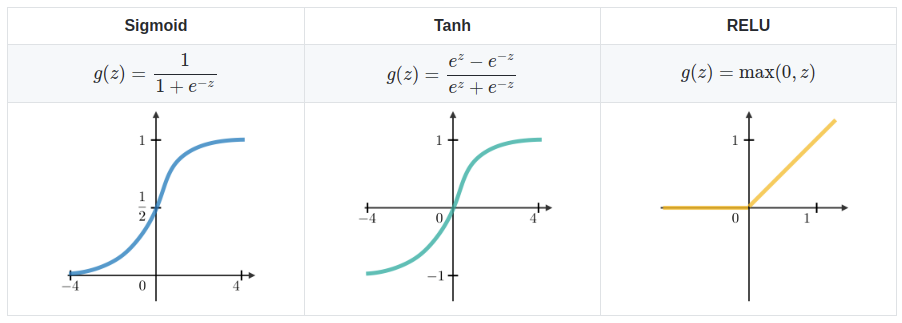

# Sigmoid:

The sigmoid function maps all output values of the node to a value between 0 and 1, as shown above on the y axis of the first plot. This is equivalent to the probabilities predicted by a logistic regression model with LogisticRegression().predict_proba_(X) in sklearn.

# Tanh (or hyperbolic tangent)

Tanh maps the output of a node to a value between -1 and 1, as shown above on the y axis of the second plot.

# ReLU (Rectified Linear Unit)

The ReLU activation function is very popular with machine learning engineers because it performs well. It maps all negative outputs from a node to 0 and returns all positive outputs as is (linear function), as shown above on the third plot. It’s thought that the excellent performance is due to some nodes being ‘switched off’ by mapping their values to 0. This is a form of regularization akin to dropout, which you will learn about in another lesson.

---

# Activation Functions in Model Development

Activation functions are hyperparameters set by the engineer. Part of model development is tuning the activation functions for the input and hidden layers to find the ones that perform the best. ReLU is a good place to start.

# Output Layer Activation Functions

The exception is the output layer. Specific activation functions are required for a model to produce specific kinds of outputs.

**Linear (regression models)**: If the model should have a continuous output that can be positive or negative. A linear activation function simply returns the value that was passed to it. g(z) = z.

**Sigmoid (binary classification models)**: if the model should only output a 0 or a 1, such as in binary classification problems.

**Softmax (multiclass classification models)**: if the model should return the most likely candidate from a finite list of options, such as a multiclass classification problem.

---

# Backward Propagation

Learning Objectives:

    - Explain backpropagation in general terms.

Vocab:

    - **Node**: one unit that processes incoming information and produces a single output number.

    - **Layer**: a collection of nodes working in parallel.

    - **Input Layer**: the first set of nodes that work on the features of the input sample.

    - **Output Layer**: the last set of nodes that output a prediction.

    - **Forward Propagation**: the processing and passing of information forward through all layers to produce an output prediction.

    - **Yhat**: the predictions of a model for all samples in X.

    - **Cost**: the combination of all of a model’s errors on all samples.

    - **Cost Function or Loss Function**: the difference between the predictions of all samples and their true labels.

    - **Backward Propagation**: the process of updating the weights of each node to reduce the cost function.

    - **Epoch**: One full cycle of forward propagation and backward propagation for all training samples.

---

# Model as a Function:

You have learned about forward propagation where a model makes a prediction, and about the cost function that tells the model how far off the predictions are from the true labels.

But, how does the model know how to adjust the weights to make a better prediction?

A predictive model is a function. A function is a broad term that describes anything that takes an input and produces a unique output. Many inputs can produce the same output, but each input can only produce one output.

A predictive model maps an input, X, with a prediction, yhat.

model(X) = yhat.

But since we know the true values of the labels, y, we can add the cost function to the predictive model function to make a new function that maps all of the sample X inputs to the cost function.

f(X) = y - g(X)

# A Little Calculus:

There is a very cool tool in calculus called differential equations. A differential equation can tell us how the output of a function changes for a single given input by finding the derivative of that function. With this tool we can determine how we need to change the model in order to change the cost function. In other words, it tells us how the weights in the output layer need to change in order to reduce the total error the model is making over all samples.

---

# Gradient Descent

Changing the weights to reduce the cost function is called Gradient Descent. It’s called that because we can visualize the cost function like a topographical map where lower error rates are ‘down’. Changing the weights to reduce the cost function is like a ball rolling downhill.


[Image Source](https://towardsdatascience.com/quick-guide-to-gradient-descent-and-its-variants-97a7afb33add)

The above image shows how, with each epoch the model reduces the cost function, or the errors it makes in predictions. Now, it doesn’t know what the cost function **actually** is, the differential equations only tell it, for a given value of the weights, which way is down and how to change the weight to reduce the cost. It doesn’t know which value for the weight will actually produce the least error. So, it tries over and over, each time changing the weight a little to reduce the cost, like a ball rolling downhill.

The above image shows gradient descent for a single weight, but our models have many weights for many inputs. The cost function gains a dimension for each weight in a node.

If we had 2 different weights to change, cost function and gradient descent would look more like the image below. Calculus also has equations for how to find how each weight needs to change when there are many inputs to a function. These are called partial derivatives because they are just a part of the derivative of the entire function. In backpropagation the model uses partial differential equations to figure out how to change each weight individually to achieve gradient descent.

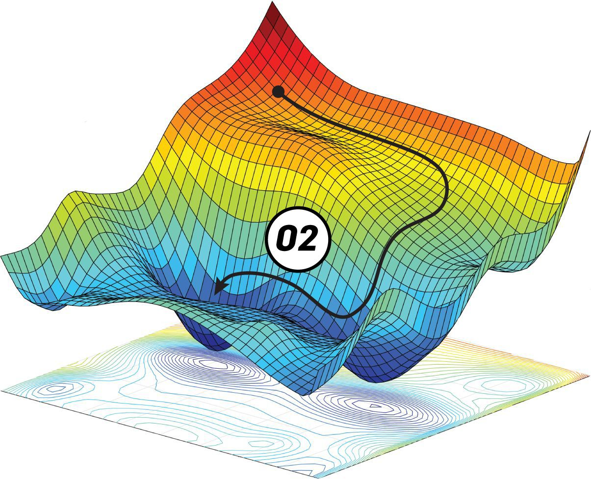

[Image Source](https://blog.paperspace.com/part-2-generic-python-implementation-of-gradient-descent-for-nn-optimization/)

For greater than 2 weights it becomes very hard to visualize the cost function because it has 1 dimension per weight plus 1 for the cost.

Watch [this video](https://www.youtube.com/watch?v=IHZwWFHWa-w&t=2s) to better understand how gradient descent works!

---

# Backward Propagation:

Okay, so we took a look at how gradient descent works to adjust the weights in the output layer, but what about the layers before it? The algorithm for backpropagation allows us to determine how each layer before the output layer needs to change based on how the one in front of it changed to reduce the cost function. The changes in the weights propagate backward through the layers.

If you want to know the full algorithm, you can check out [this explanation](https://towardsdatascience.com/the-maths-behind-back-propagation-cf6714736abf) by Shane de Silva.


[Image Source](https://deepai.org/machine-learning-glossary-and-terms/backpropagation)


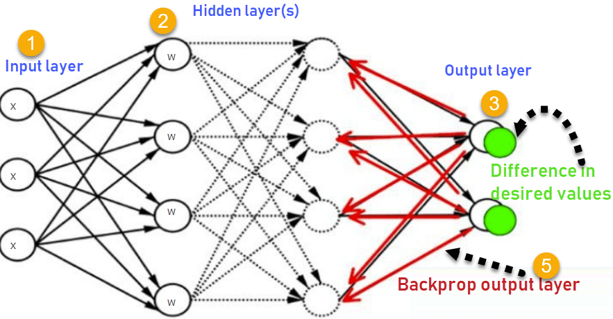

[image Source](https://www.guru99.com/backpropogation-neural-network.html)

---

# Neural Networks in Keras

Learning Objectives:

    - Create your first neural network in Keras.

---

# Intro to Keras

[Keras](https://keras.io/) is an API that acts as an interface for Tensorflow. It is a popular choice for building neural networks, especially as you are first learning, since it abstracts away most of the complexities involved in deep learning. Another popular choice is [Pytorch](https://pytorch.org/) - while we will not formally cover Pytorch, you might want to challenge yourself to learn this library as well. More resources will be provided at the end of this chapter.

# Neural Network in Keras

To create a neural network in Keras, we can follow three easy steps:

    1. Define our network structure
    2. Compile our model
    3. Fit our model

Let's try it on a classification problem!

**Note**: you can watch a video walkthrough of this code at the end of this module.

# Mount Data
```
from google.colab import drive
drive.mount('/content/drive')
```
# Import Libraries
```
# Imports
import numpy as np
import matplotlib.pyplot as plt
import pandas as pd
from sklearn.preprocessing import StandardScaler
from sklearn.model_selection import train_test_split
from tensorflow.keras.models import Sequential
from tensorflow.keras.layers import Dense
```
# Import Data

The dataset is from [Data.World](https://data.world/exercises/logistic-regression-exercise-1) and the goal is to use basketball player statistics to predict whether or not a NBA Rookie will last at least 5 years in the league. You can download the data [here](https://s3.amazonaws.com/General_V88/boomyeah2015/codingdojo/curriculum/content/chapter/nba.csv).

The target column is defined as:

- y = 0 if career years played < 5
- y = 1 if career years played >= 5
```
# Get data
df = pd.read_csv('/content/drive/MyDrive/DS 12wk PT Curriculum/data/nba.csv', index_col = 'Name')
df.head()
```


# Clean Data & Split into X & y
```
# Drop missings
df.dropna(inplace = True)
# Save X data
X = df.drop(columns = 'TARGET_5Yrs')
# Encode our target
y = df['TARGET_5Yrs']
```
# Train/Test Split
```
# Train test split
X_train, X_test, y_train, y_test = train_test_split(X, y, random_state=3)
```
# Scale Data

We want to scale our data when using neural networks. This can help the model fit faster and find the optimal solution.
```
# Scale our data
scaler = StandardScaler()
X_train = scaler.fit_transform(X_train)
X_test = scaler.transform(X_test)
```
**Step 1: Define our network structure**

The first thing we need to define is how many features we have in our X data. This will be used in our first hidden layer, in which we have to tell Keras how many features to be expecting from our input layer.
```
# Step 1: Define our network structure
# Save the number of features we have as our input shape
input_shape = X_train.shape[1]
input_shape

    19
```
We can then define our model type. We will use a Sequential model - this means that our model layers are run sequentially. This is a very common type of model to use in Keras.
```
# Sequential model
model = Sequential()
```
We can now add our hidden layers! We will use two hidden layers in this example, but you can really use as few or as many as you want. However, be careful adding too many hidden layers, as this increases complexity, furthers the nature of the black box, and can lead to overfitting.

There are many types of layers in Keras and these refer to the type of neural network we are fitting. The most common layer is a Dense layer, which means that the network is fully connected.

Within a dense layer, we need to specify the number of neurons we want in that layer and the type of activation function we want to use. The number of neurons in each layer is ultimately up to you - as a general rule of thumb, use less than or equal to the number of features you have and decrease the number of neurons as you go through the network. Within hidden layers, it is common to use the ReLU function, as it tends to perform well.
```
# First hidden layer
model.add(Dense(19, # How many neurons you have in your first hidden layer
                input_dim = input_shape, # What is the shape of your input features (number of columns)
                activation = 'relu')) # What activation function are you using?
# Second hidden layer
model.add(Dense(10, # How many neurons you have in your second hidden layer
                activation = 'relu')) # What activation function are you using?
```
We then need to add our output layer. The output layer needs to have the number of nodes you want in your output layer (this is often 1, but can be more for multiclass classification) and the activation function for the specific task. The activation function determines the range of values that the output layer can and should take on.

For regression problems, we want to use the linear activation function.

For classification problems, we want to use the sigmoid activation function.
```
# Output layer
model.add(Dense(1, activation = 'sigmoid'))
```
**Step 2: Compile our model**

When compiling our model, we need to specify which loss function we are using and what optimizer we will use to fit. A common optimizer to choose is the Adam optimizer.

For regression problems, we would want to use a loss function like MSE.

For binary classification problems like this one, we want to use the binary cross-entropy loss. This can be abbreviated as "bce" in Keras.

For multiclass classification problems, we would use categorical cross-entropy.
```
# Step 2: Compile
model.compile(loss = 'bce', optimizer = 'adam')
```
# Step 3: Fit our model

We can finally fit our model to our training data! We often want to save the fitting process so we can visualize our loss over time.
```
# Step 3: Fit our model
history = model.fit(X_train, y_train,
                    validation_data = (X_test, y_test), 
                    epochs=10)
```
```
# Visualize the loss
plt.plot(history.history['loss'], label='Train loss')
plt.plot(history.history['val_loss'], label='Test Loss')
plt.legend();
```

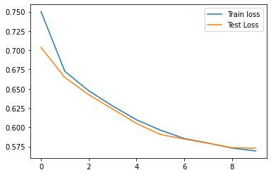

We can see that as we increase the number of epochs we train our model for, both our training and validation loss decreases! This is exactly what we want, as we want the loss to be as low as possible. In reality, we would run our model for a lot more than 10 epochs.

---

# Bias and Variance in Deep Learning

Learning Objectives:

    - Adjust model complexity to optimize bias and variance.
    - Adjust model training time to optimize bias and variance.

---

# Model Complexity

As you recall:

Variance in model performance is related to overfitting. It means a model does well on the data it trained on, but cannot generalize that learning to new data.

Bias in model performance is related to underfitting. It means a model has not successfully fit to the training data and is unable to make good predictions on either the training data or the testing data.

# Underfitting: Not Complex Enough

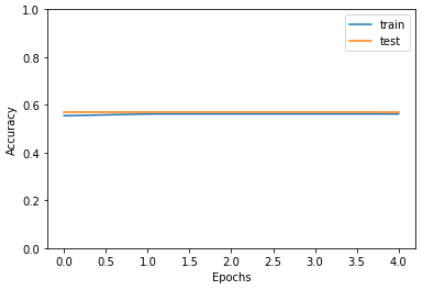

The image above shows the training history of an underfit model. The accuracy of the model on both the training and the testing sets is low and is not improving.

If your model is underfit and is not able to perform well even on the training data it may mean that you need more complexity.

You can add more layers (usually better)

Or you can add more neurons (sometimes better)

More complexity usually causes lower bias, but potentially higher variance.

# Overfitting: Too Complex

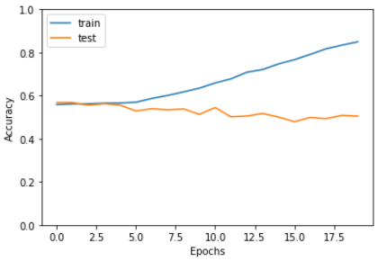

The image above shows the training history of an overfit model. Notice that the accuracy of the model on the training data continues to improve, but the accuracy on the testing data does not.

A common source of overfitting in deep learning is too much complexity. That means a model with too many total weights.

More layers → more complexity

More neurons → more complexity

If your model is overfitting, one way to combat that is to make it smaller!

Less complexity usually causes higher bias, but might lower variance.

Another important tool in combatting a high variance in regularization, such as dropout layers. You'll learn about these in a future lesson.
Training and Overtraining

Another source of variance can be over-training. That means you are training your model for too many or too few epochs.

In the model training plot above we see the accuracy of the model on the test set begins to fall starting at about 10 epochs. This model was over-trained. One way to combat overtraining is to use an early stopping callback, which you will learn about in a future lesson.

---

# Training and Overtraining

Another source of variance can be over-training. That means you are training your model for too many or too few epochs.


In the model training plot above we see the accuracy of the model on the test set begins to fall starting at about 10 epochs. This model was over-trained. One way to combat overtraining is to use an early stopping callback, which you will learn about in a future lesson.

---

Dropout

Learning Objectives:

    - Describe how to prevent overfitting in deep learning models using the regularization technique of dropout.

---

# Deep Learning Regularization

Neural networks are very prone to overfitting. In order to combat this, we need to regularize so that our model is not too overfit to the training data and is able to perform well on new data as well.

Three common regularization techniques for deep learning include:

    - Dropout
    - Early stopping
    - L1/L2 regularization

# Dropout

One of the most common forms of regularization is dropout. What this does is drops out a portion of the neurons so that the model does not learn weights and biases that are too perfect for the training set.

Visually, a dropout layer looks like this:

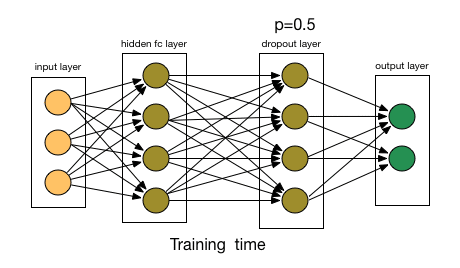

Notice that in the dropout layer, each neuron has a 50% probability (p = 0.5) of not being included/updated in that epoch. When we finalize our model and run it through the testing data, we include all of the neurons and do not drop any out.

# Dropout in Keras

Let's try this in Keras! We will look at a neural network with and without dropout.

**Note**: you can watch a video walkthrough of this code at the end of this module.

# Mount Data
```
from google.colab import drive
drive.mount('/content/drive')
```
# Import Libraries
```
# Imports
import numpy as np
import matplotlib.pyplot as plt
import pandas as pd
from sklearn.model_selection import train_test_split
from sklearn.preprocessing import StandardScaler
from tensorflow.keras.models import Sequential
from tensorflow.keras.layers import Dense, Dropout
```
# Get Data

We will use the NBA rookie data again to predict whether or not we think a rookie will last at least 5 years in the league. You can download the data [here](https://s3.amazonaws.com/General_V88/boomyeah2015/codingdojo/curriculum/content/chapter/nba.csv).
```
# Get data
df = pd.read_csv('/content/drive/path_to_data/nba.csv', index_col = 'Name')
df.head()
```


# Clean Data & Split into X & y
```
# Drop missings
df.dropna(inplace = True)
# Save X data
X = df.drop(columns = 'TARGET_5Yrs')
# Encode our target
y = df['TARGET_5Yrs']
```
# Train/Test Split
```
# Train test split
X_train, X_test, y_train, y_test = train_test_split(X, y, random_state=3)
```
# Scale Data
```
# Scale our data
scaler = StandardScaler()
X_train = scaler.fit_transform(X_train)
X_test = scaler.transform(X_test)
```
Let's compare the performance of a model with and without dropout. We will start by building a model without dropout.
```
# Create Feedforward Neural Network

# Step 1: Define our network structure
# Save the number of features we have as our input shape
input_shape = X_train.shape[1]
input_shape

    19
```
```
# Without dropout
# Sequential model
model = Sequential()
# First hidden layer
model.add(Dense(19, # How many neurons you have in your first hidden layer
                input_dim = input_shape, # What is the shape of your input features (number of columns)
                activation = 'relu')) # What activation function are you using?
model.add(Dense(10, 
                activation = 'relu'))
model.add(Dense(1, activation = 'sigmoid'))
model.compile(loss = 'bce', optimizer = 'adam')
history = model.fit(X_train, y_train,
                    validation_data = (X_test, y_test), 
                    epochs=100)
```
```
# Visualize the loss
plt.plot(history.history['loss'], label='Train loss')
plt.plot(history.history['val_loss'], label='Test Loss')
plt.legend();
```

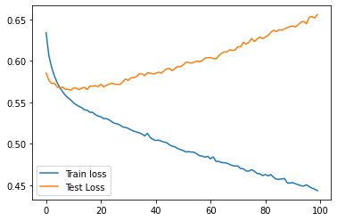

Yikes, our model is super overfit! Notice how the training loss continues to decrease while the testing loss begins to increase as we increase the number of epochs we train our model for. This is a super common problem with neural networks and tells us that our model is overfit and is not performing well on unseen data.

**Let's build this same model with dropout to try to prevent overfitting**. Dropout in Keras is coded as another layer, after the layer you would like to dropout. You need to specify the probability of dropout as well (the probability that each individual neuron has to dropout of the training that epoch).
```
# With dropout
# Sequential model
model = Sequential()
# First hidden layer
model.add(Dense(19, # How many neurons you have in your first hidden layer
                input_dim = input_shape, # What is the shape of your input features (number of columns)
                activation = 'relu')) # What activation function are you using?
model.add(Dropout(.2))
model.add(Dense(10, 
                activation = 'relu'))
model.add(Dropout(0.2))
model.add(Dense(1, activation = 'sigmoid'))
model.compile(loss = 'bce', optimizer = 'adam')
history = model.fit(X_train, y_train,
                    validation_data = (X_test, y_test), 
                    epochs=100)
```
```
# Visualize the loss
plt.plot(history.history['loss'], label='Train loss')
plt.plot(history.history['val_loss'], label='Test Loss')
plt.legend();
```

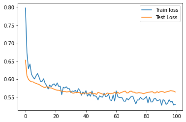

Nice, this is way less overfit!

---

# Early Stopping

Learning Objectives:

    - Demonstrate how to prevent overfitting in deep learning models using the regularization technique of early stopping.

---

# Early Stopping

Early stopping is exactly what it sounds like - we stop training the model early. Instead of training for a certain number of epochs, we train the model until the validation loss begins to increase. This ensures our model does not keep overfitting as we go through more and more epochs.


# Early Stopping in Keras

Let's try this in Keras! We will look at a neural network with and without early stopping.

**Note**: you can watch a video walkthrough of this code at the end of this module.

# Mount Data
```
from google.colab import drive
drive.mount('/content/drive')

Import Libraries

# Imports
import numpy as np
import matplotlib.pyplot as plt
import pandas as pd
from sklearn.model_selection import train_test_split
from sklearn.preprocessing import StandardScaler
from tensorflow.keras.models import Sequential
from tensorflow.keras.layers import Dense
from tensorflow.keras.callbacks import EarlyStopping
```
# Get Data

We will use the NBA rookie data again to predict whether or not we think a rookie will last at least 5 years in the league.
```
# Get data
df = pd.read_csv('/content/drive/path_to_data/nba.csv', index_col = 'Name')
df.head()
```


# Clean Data & Split into X & y
```
# Drop missings
df.dropna(inplace = True)
# Save X data
X = df.drop(columns = 'TARGET_5Yrs')
# Encode our target
y = df['TARGET_5Yrs']
```
# Train/Test Split
```
# Train test split
X_train, X_test, y_train, y_test = train_test_split(X, y, random_state=3)
```
# Scale Data
```
# Scale our data
scaler = StandardScaler()
X_train = scaler.fit_transform(X_train)
X_test = scaler.transform(X_test)
```
Let's compare the performance of a model with and without early stopping. We will start by building a model without early stopping.

# Create Feedforward Neural Network
```
# Step 1: Define our network structure
# Save the number of features we have as our input shape
input_shape = X_train.shape[1]
input_shape

    19
```
```
# Without early stopping
# Sequential model
model = Sequential()
# First hidden layer
model.add(Dense(19, # How many neurons you have in your first hidden layer
                input_dim = input_shape, # What is the shape of your input features (number of columns)
                activation = 'relu')) # What activation function are you using?
model.add(Dense(10, 
                activation = 'relu'))
model.add(Dense(1, activation = 'sigmoid'))
model.compile(loss = 'bce', optimizer = 'adam')
history = model.fit(X_train, y_train,
                    validation_data = (X_test, y_test), 
                    epochs=100)
```
```
# Visualize the loss
plt.plot(history.history['loss'], label='Train loss')
plt.plot(history.history['val_loss'], label='Test Loss')
plt.legend();
```
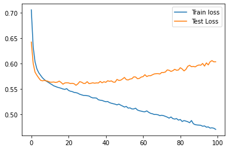

Yikes, our model is super overfit! Notice how the training loss continues to decrease while the testing loss begins to increase as we increase the number of epochs we train our model for. This is a super common problem with neural networks and tells us that our model is overfit and is not performing well on unseen data.

Let's build this same model with early stopping to try to prevent overfitting by stopping when the validation loss begins to increase.
```
# With early stopping
# Sequential model
model = Sequential()
# First hidden layer
model.add(Dense(19, # How many neurons you have in your first hidden layer
                input_dim =input_shape, # What is the shape of your input features (number of columns)
                activation = 'relu')) # What activation function are you using?
model.add(Dense(10, 
                activation = 'relu'))
model.add(Dense(1, activation = 'sigmoid'))
model.compile(loss = 'bce', optimizer = 'adam')
early_stopping = EarlyStopping(patience = 5)
history = model.fit(X_train, y_train,
                    validation_data = (X_test, y_test), 
                    epochs=100,
                    callbacks = [early_stopping])
```
```
# Visualize the loss
plt.plot(history.history['loss'], label='Train loss')
plt.plot(history.history['val_loss'], label='Test Loss')
plt.legend();
```
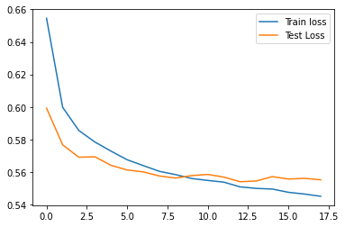

This is way less overfit because we only trained for about 18 epochs (yours might have trained for a slightly different number of epochs). Early stopping can prevent overfitting and save you training time.

You can also use dropout and early stopping in the same model.

---

# Regression Models in Keras

Learning Objectives:

    - Create a feed-forward regression model in Keras.
    - Evaluate a feed-forward regression model in Keras.

# Steps


Photo by [Dawn McDonald](https://unsplash.com/@dpreacherdawn?utm_source=unsplash&utm_medium=referral&utm_content=creditCopyText) on [Unsplash](https://unsplash.com/s/photos/fuel?utm_source=unsplash&utm_medium=referral&utm_content=creditCopyText)

As you recall, a regression problem is one in which you are trying to predict a value. Some values are greater and some values are less. One example is predicting the miles-per-gallon that a vehicle may run for. Let’s try this in Keras.

# In this lesson, we will:

    1. Import necessary libraries
    2. Load and process the data
    3. Build a feed-forward regression model with an appropriate output layer and loss function
    4. Evaluate the model using regression metrics

# Import Libraries
```
import pandas as pd
import numpy as np
import matplotlib.pyplot as plt
 
# Keras
from tensorflow.keras import Sequential
from tensorflow.keras import metrics
from tensorflow.keras.layers import Dense, Dropout
 
# Sci-kit learn
from sklearn.metrics import mean_squared_error, r2_score, mean_absolute_error
from sklearn.preprocessing import StandardScaler, OneHotEncoder
from sklearn.compose import make_column_transformer
from sklearn.model_selection import train_test_split
```
We will also define a custom function to plot our model's learning history
```
# Learning history plotting function
def plot_history(history):
  """Takes a keras model learning history and plots each metric"""
  
  metrics = history.history.keys()
  
  for metric in metrics:
      if not 'val' in metric:
        plt.plot(history.history[f'{metric}'], label=f'{metric}')
        if f'val_{metric}' in metrics:
          plt.plot(history.history[f'val_{metric}'], label=f'val_{metric}')
        plt.legend()
        plt.title(f'{metric}')
        plt.show()
```
---

# Load and Preprocess the Data

The data we will be using for this model is hosted by the University of Irvine Machine Learning Repository. According to the original paper that presented the data:

"The data concerns city-cycle fuel consumption in miles per gallon, to be predicted in terms of 3 multivalued discrete and 5 continuous attributes." (Quinlan, 1993)

The data contains both continuous and discrete (categorical) features. Since the categories are numeric, Pandas will import them as integer types, but we will one-hot encode them.\
```
# import data
 
reg_url = 'https://docs.google.com/spreadsheets/d/e/2PACX-1vTg36jLawSOgGP9hp0oJ3OYZiHMWbuGLiau-8DMjtcKNv7v9Zy_zFBQs9gZU-44GGeIyfXE2iwo26_z/pub?output=csv'
df_reg = pd.read_csv(reg_url)
 
# drop car name columns
df_reg = df_reg.drop(columns='car name')
 
df_reg.head()
```


```
# check missing values and duplicates
print('missing values', df_reg.info())
print('\nduplicated rows', df_reg.duplicated().sum())
```

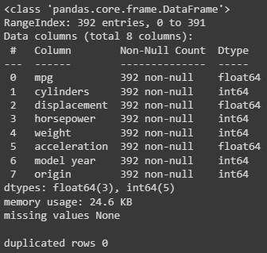
```
# split data
 
X = df_reg.drop(columns='mpg')
y = df_reg['mpg']
 
X_train, X_test, y_train, y_test = train_test_split(X, y, random_state = 42)
```
```
# preprocess the data
 
# transformers
scaler = StandardScaler()
ohe = OneHotEncoder(sparse=False, handle_unknown='ignore')
 
# lists of columns for transformer
cat_cols = ['cylinders','model year','origin']
num_cols = X_train.columns.drop(cat_cols)
 
# column transformer
preprocessor = make_column_transformer((ohe, cat_cols), (scaler, num_cols))
 
# process the data
preprocessor.fit(X_train)
X_train_proc = preprocessor.transform(X_train)
X_test_proc = preprocessor.transform(X_test)
 
X_train_proc.shape
```

`(294, 25)`

---

# Build and Train the Model

We will set the input dimensions to the number of columns in our processed data so Keras can construct an implicit input layer. We will then construct a fairly small model with two hidden layers and 10 nodes in each layer.

Since this is a regression model the final layer should have one node and a linear activation function.
```
# create model architecture
input_dim = X_train_proc.shape[1]
 
reg_model = Sequential()
 
reg_model.add(Dense(10, input_dim=input_dim, activation='relu'))
reg_model.add(Dense(10, activation='relu'))
reg_model.add(Dense(1, activation='linear'))
 
reg_model.summary()
```
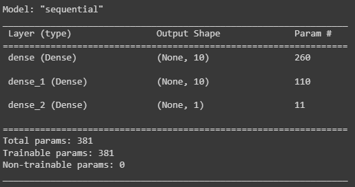

# Loss

Next we compile the model. We need to be sure to use a regression metric for the loss function. A loss function must always decrease as the model error decreases. For this reason, for instance, R2 would not work as a loss function, since it increases as the model learns.

Most deep learning regression models will use MSE as the loss function.

# Optimizer

Optimizers are optional but can speed up learning. The ‘Adam’ optimizer is a popular one for all model types that use gradient descent for learning.

If you want to know more, you can refer to the documentation. https://keras.io/api/optimizers/

# Metrics

We can, optionally, add a list of metrics to our compile call and the model will keep track of how those metrics change in each epoch. Some metrics are accessible as string shortcuts, such as ‘mae’, but others must be instantiated as metrics classes, like:

metrics.MeanAbsoluteError()

This is different from Sci-kit Learn. In Sci-kit learn we used functions to return metrics, but in Keras it expects classes that are instantiated for each model. This is because behind the scenes these class instances will be fit on the specific data so they can make calculations more quickly. Tensorflow is all about efficiency! The history of these metrics for each epoch will be stored in a dictionary returned by the .fit() method.

A list of available metrics can be found at: https://keras.io/api/metrics/
```
# compile model with additional metrics
 
reg_model.compile(loss='mse',
                  optimizer='adam',
                  metrics=[metrics.MeanAbsoluteError(),
                           metrics.RootMeanSquaredError()])
```

Next, we fit the model and save the learning history. We will set the verbosity to 0 to avoid the long, epoch by epoch output, but you can change that if you like to see the numbers go by during training.
```
history = reg_model.fit(X_train_proc, y_train,
                        validation_data = (X_test_proc, y_test),
                        epochs=100,
                        verbose=0)
```
We can plot the learning history for the loss function as well as all of the metrics we asked the model to keep track #of in the .compile() call. These are all stored in the history dictionary.
```
# plot learning
 
plot_history(history)
```

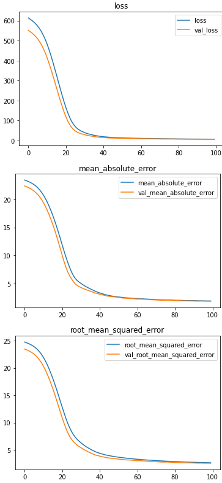

This model has a nice hockey-stick-shaped learning curve and the final training and testing scores are very similar. It does not seem to suffer from overfitting or underfitting. However, let’s check the metrics directly using Sci-kit learn metrics functions to get some solid numbers.

Evaluating a final regression model in Keras is very similar to evaluating a more traditional Sci-kit Learn model.
```
# evaluate model
 
y_pred = reg_model.predict(X_test_proc)
 
print(f'final RMSE: {np.sqrt(mean_squared_error(y_test, y_pred))}')
print(f'final MAE: {mean_absolute_error(y_test, y_pred)}')
print(f'final R2: {r2_score(y_test, y_pred)}')
```

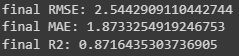

The R2 score shows us that our model is explaining about 87% of the variance in the target, the mean absolute error shows us that our model tends to make an error of about 2 miles per gallon, and since the root mean squared error is significantly higher than the mean absolute error, this shows us that it has made some larger errors on some samples.

The code for this lesson is also available in [this notebook](https://colab.research.google.com/drive/14ULbT1bOgzVidnElejv9RoQj7CCsKaw5?usp=sharing).

**Note: due to the stochastic nature of deep learning models, you may not get the same results as this lesson, and the notebook outputs may not match.**

---

# Binary Classification Models in Keras

Learning Objectives:

    - Create a feed-forward model for binary classification using appropriate output layers, loss functions, and metrics in Keras.
    - Evaluate a feed-forward binary classification model created in Kears using Sci-kit Learn metric functions..

---

# Steps


Photo by [National Cancer Institute](https://unsplash.com/@nci?utm_source=unsplash&utm_medium=referral&utm_content=creditCopyText) on [Unsplash](https://unsplash.com/s/photos/imaging-study?utm_source=unsplash&utm_medium=referral&utm_content=creditCopyText)

As you recall, a classification problem is one in which you are trying to predict a discrete, finite, and non-overlapping number of classes. Binary classification is when you are trying to predict which of exactly 2 classes a sample belongs to. One example would be predicting if a tumor were malignant or benign. Let’s try this in Keras.

# In this lesson, we will:

    1. Import necessary libraries
    2. Load and process the data
    3. Build a feed-forward binary classification model with an appropriate output layer and loss function
    4. Evaluate the model using classification metrics and a confusion matrix

# Import Libraries
```
import pandas as pd
import numpy as np
import matplotlib.pyplot as plt
 
#Keras
from tensorflow.keras import Sequential
from tensorflow.keras import metrics
from tensorflow.keras.layers import Dense, Dropout
 
#Sci-kit Learn
from sklearn.metrics import classification_report, ConfusionMatrixDisplay
from sklearn.preprocessing import StandardScaler
from sklearn.model_selection import train_test_split
```
We will also define a custom function to plot our learning history from the model.

#Learning history plotting function

def plot_history(history):
```
# Learning history plotting function
def plot_history(history):
  """Takes a keras model learning history and plots each metric"""
  
  metrics = history.history.keys()
  
  for metric in metrics:
      if not 'val' in metric:
        plt.plot(history.history[f'{metric}'], label=f'{metric}')
        if f'val_{metric}' in metrics:
          plt.plot(history.history[f'val_{metric}'], label=f'val_{metric}')
        plt.legend()
        plt.title(f'{metric}')
        plt.show()
```
# Load and Process Data

This dataset was taken from the University of Irvine Machine Learning Repository and describes the cell nuclei of breast tumors. It was first presented in 1992. The labels are ‘M’ for malignant and ‘B’ for benign tumors. Original [Data source](https://archive.ics.uci.edu/ml/datasets/breast+cancer+wisconsin+(diagnostic)).
```
# load classification data
clf_url = 'https://docs.google.com/spreadsheets/d/e/2PACX-1vTZf6XIYPLjxmCS8BzzEot1DaW4ns7P2q1CVqnZ6qw9f-A3bkCPbXX3H9vOE2_zrGKSxy4ZMaTf7lt4/pub?output=csv'
df_clf = pd.read_csv(clf_url)
df_clf.head()
```


**Note**: not all columns shown.

We will check for duplicates, datatypes, and missing values.
```
# check for duplicates and null values
print(f'data info: {df_clf.info()}')
print(f'\n duplicate rows: {df_clf.duplicated().sum()}')
```
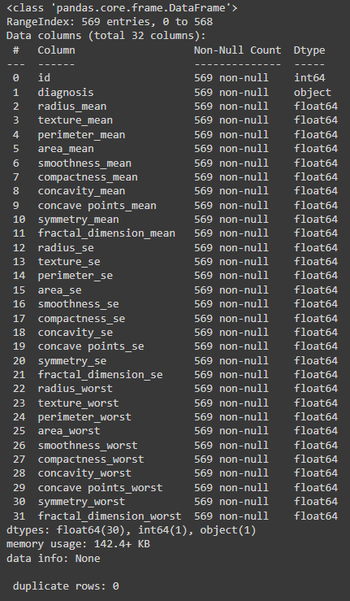

There is no missing data, no duplicates, and all features are numeric except for the target. Keras models do not accept strings as targets like Sci-kit Learn models, so we will need to encode the labels. In this case, we will just use a simple .replace() call. We will also drop the ‘id’ column since it doesn’t contain any information about the tumor.
```
# drop id and encode diagnosis
df_clf.drop(columns='id', inplace=True)
df_clf['diagnosis'].replace(['M','B'],[1,0], inplace=True)
df_clf.head()
```


Since this is classification and our class balance is very important in both model performance and evaluation, let’s check the balance of classes.
```
# check classes and balance
df_clf['diagnosis'].value_counts()
```
The imbalance is not too bad, about 2:3. We will just need to remember this for understanding our accuracy score.

Next we split the data.
```
# split data
 
X = df_clf.drop(columns='diagnosis')
y = df_clf['diagnosis']
 
X_train, X_test, y_train, y_test = train_test_split(X, y, random_state=42)
```
Since all of the features are numeric and there are no missing values, we can just scale it. **Remember to always scale your data before using it for deep learning.**
```
# scale data
 
scaler = StandardScaler()
 
X_train_sc = scaler.fit_transform(X_train)
X_test_sc = scaler.transform(X_test)
```
---

# Build the Model

We will build a simple model with two hidden layers and 10 nodes in each layer. We will pass the number of features in the data to the input_dim= argument of the first layer so that Keras knows how to construct the implicit input layer.

Since this is binary classification, the output layer will have one node and a ‘sigmoid’ activation function. The sigmoid function will change any value passed to it to a value between 0 and 1. That works because our classes in our target are 0 and 1. The predicted class will be the class number the predicted value is closest to. We will round this value later when we evaluate the model.
```
# create model architecture
 
input_dim = X_train_sc.shape[1]
 
clf_model = Sequential()
 
clf_model.add(Dense(10, input_dim=input_dim, activation='relu'))
clf_model.add(Dense(10, activation='relu'))
clf_model.add(Dense(1, activation='sigmoid'))
```
The next step is to compile the model. We must consider 3 things to do this correctly:

# Loss

We use a binary cross-entropy loss function, or ‘bce’. Recall that the loss function should always decrease as the model learns, so we need some metric that decreases as the model gets better. Metrics like accuracy or f1-score won’t work as a loss because they increase in value as the model converges to a good solution. Binary cross-entropy decreases as the error rate decreases. If you want to know more about loss functions, what they do, and when each should be used, you can research the documentation at: https://keras.io/api/losses/

# Optimizer

There are many options for optimizers, which tend to improve the learning speed of a model. Adam is a popular one. You can research others at https://keras.io/api/optimizers/.

# Metrics

The .compile() method lets us pass additional metrics to be tracked for each learning epoch. If we want to see how they change as the model learns we can list them here.

This method recognizes some metrics as string shortcuts, such as ‘accuracy’, but others must be passed as class instances, such as metrics.Recall(). These class instances work differently than the functions that Sci-kit learn offers for evaluation purposes. They fit on the specific data for the model and should not be reused. Instantiate a new instance of each metrics class for each model iteration.

There is no native class for the f1-score metric, however, it’s possible to create custom metric classes. The code for some implementations of f1 score is available online. They are a little complicated, but you could copy and paste them with attribution if you wanted to.

You can learn more about available metrics here: https://keras.io/api/metrics/

**Since this is a classification problem, only classification metrics should be used here.**
```
# compile model with metrics
clf_model.compile(loss='bce', optimizer='adam', metrics=['accuracy',
                                                         metrics.Precision(),
                                                         metrics.Recall()])
```
Next we will fit the model on the data and use the validation data to identify any overfitting. The model will evaluate itself using all metrics passed in the .compile() call for every epoch on both sets of data, though it will only actually train on the training data. We will also set verbose=0 to avoid the long output of learning metrics by epoch. If you want to see the training metrics in real-time, you can change this argument.
```
history = clf_model.fit(X_train_sc, y_train,
                        validation_data=(X_test_sc, y_test),
                        epochs=15,
                        verbose=0)
```
Let’s use our custom function to see the history of learning using each of our passed metrics.
```
# plot learning history
plot_history(history)
```

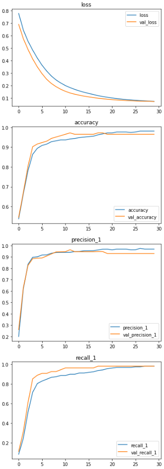

It appears that learning has leveled off, the train and test set metrics are not overly far apart, and the final scores seem pretty good. There don’t appear to be any serious problems with overfitting or underfitting.

Let’s look at a classification report and a confusion matrix.

We are going to use the Sci-kit Learn tools for this, but we need to do one step before we can. A sigmoid function doesn’t return just 0s and 1, but a value between those. Sci-kit Learn classification metrics can’t handle floats, so we need to round the predictions to the closest integer before using them for evaluation.

ConfusionMatrixDisplay.from_estimator() can’t use a Keras model to create a confusion matrix, so we will use the ConfusionMatrixDisplay.from_predictions() method to create our confusion matrix heatmap.
```
# evaluate model
 
#make predictions
y_preds = clf_model.predict(X_test_sc)
 
# round the predictions
y_preds = np.round(y_preds)
 
print(classification_report(y_test, y_preds))
 
ConfusionMatrixDisplay.from_predictions(y_test, y_preds, cmap='Blues');
```

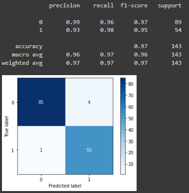

# Evaluation

Our model seems to have performed well with higher precision on class 0 (benign) and a higher recall on class 1 (malignant). This is good. It shows us that when the model predicts benign, it is seldom wrong and it was successful in identifying most of the malignant tumors. The confusion matrix confirms this showing that it only misclassified one malignant tumor as benign.

The notebook with the code for this lesson is available [here](https://colab.research.google.com/drive/1zCp0MTkFGWEailEV6jftwfJKyXsw_aR0?usp=sharing).

**Note: due to the stochastic nature of deep learning models, you may not get the same results as this lesson, and the notebook outputs may not match.**

---

# Multiclass Classification Models in Keras

Learning Objectives:

    - Preprocess a multiclass target for a Keras deep learning model.
    - Create a feed-forward model for multiclass classification using appropriate output layers, loss functions, and metrics in Keras.
    - Evaluate a feed-forward multiclass classification model created in Keras using Sci-kit Learn metric functions.

---

# Steps

Photo by Sebastian Pena Lambarri on Unsplash

As you recall, a classification problem is one in which you are trying to predict a discrete, finite, and non-overlapping number of classes. Multiclass classification is when you are trying to predict which of 3 or more classes a sample belongs to. This is handled a little differently in Keras models than binary classification, although most of the same metrics can apply. One example is a model that tries to classify fish into a limited number of known species using measurements of size and weight. Let’s try this in Keras.!
In this lesson we will:

    Import necessary libraries
    Load and process data,
    One-hot encode the target variable
    Build a feed-forward multiclass classification model with an appropriate output layer and loss function
    Evaluate the model using classification metrics and a confusion matrix

# Import Libraries
```
import pandas as pd
import numpy as np
import matplotlib.pyplot as plt
 
#Keras
from tensorflow.keras import Sequential
from tensorflow.keras import metrics
from tensorflow.keras.layers import Dense, Dropout
 
#Sci-kit Learn
from sklearn.metrics import classification_report, ConfusionMatrixDisplay
from sklearn.preprocessing import StandardScaler
from sklearn.model_selection import train_test_split
```
We will also define a custom function to plot our learning history from the model.
```
# Learning history plotting function
def plot_history(history):
  """Takes a keras model learning history and plots each metric"""
  
  metrics = history.history.keys()
  
  for metric in metrics:
      if not 'val' in metric:
        plt.plot(history.history[f'{metric}'], label=f'{metric}')
        if f'val_{metric}' in metrics:
          plt.plot(history.history[f'val_{metric}'], label=f'val_{metric}')
        plt.legend()
        plt.title(f'{metric}')
        plt.show()
```
# Load and Process Data

The data we will be using is collected from a fish market and represents data about nine different common fish species. It was originally downloaded from Kaggle and originally provided by SAS OnDemand for Academics.

This dataset only has 159 rows and that would usually be too small for deep learning to be effective, however, it will work for demonstration purposes.
```
# Load Data
multi_url = 'https://docs.google.com/spreadsheets/d/e/2PACX-1vR_I2xiiboTvyDr5-Cvvo_m7tnoT2tVnzOWUYf2xBZEhTWiWtZOyerF3c2aQeym10S8T2yHnTPnlPi2/pub?output=csv'
df_multi = pd.read_csv(multi_url)
df_multi.head()

# Check for duplicates and missing data
print(df_multi.info())
print(f'{df_multi.duplicated().sum()} duplicate rows')

Other than the target all of the columns are numeric and there are no duplicates. However, we have some rows with missing values. Let’s see how many rows are missing at least one value.

# count rows with missing values
na_rows = df_multi.isna().any(axis=1).sum()
print(f'{na_rows} rows are missing data')
print(f'{na_rows/len(df_multi)*100:.1f}% of rows are missing data')
```
This is more than 10% and normally we would try to impute these. However, we may worry that imputation errors will severely affect our model. We will try dropping them, but if we were going to continue with this project we might try both versions of the data, with dropped nulls and imputed nulls, to see which trains a better model.
```
# drop missing data
df_multi.dropna(inplace=True)
print(df_multi.info())

Since we are performing classification, we should always check our class balance to help us make decisions about data preparation and to help us properly interpret our accuracy scores.

# check class balance
df_multi['Species'].value_counts()
```
Our training set is very imbalanced. We could apply some balancing techniques, but with so few training instances it would be pointless to oversample or undersample the data. We could try SMOTE, but we might expect limited success. In this case, we will just leave it and hope for the best.

There are also only 2 ‘Beam’ fish in the dataset. A Google search shows that there is no fish named a ‘Beam’. We will combine this with ‘Bream’
```
df_multi['Species'].replace('Beam', 'Bream', inplace=True)
```
Next, we will split the data into X features and y target and training and validation sets.
```
# split data
X = df_multi.drop(columns='Species')
y = df_multi['Species']
X_train, X_test, y_train, y_test = train_test_split(X, y,
                                                    random_state=42,
                                                    stratify=y)
```
We can also expect our accuracy score to be an unreliable measure of our model’s performance.

Data features for deep learning should always be scaled to avoid exploding weights. Exploding weights causes some weights to grow very large and be given too much emphasis by the model. This can lead to overfitting problems.
```
# scale data
scaler = StandardScaler()
 
X_train_sc = scaler.fit_transform(X_train)
X_test_sc = scaler.transform(X_test)
```
# Encode the Target

One important difference between binary classification and multiclass classification is how we encode the target. In binary classification, we need to make sure that the two classes are encoded as 0 and 1.

In multiclass classification, we both numerically encode and one-hot encode, or binarize, the target.

We will end up with 3 versions of the labels: original, numerically encoded, and binarized.
```
from sklearn.preprocessing import LabelEncoder, LabelBinarizer
# encode labels
encoder = LabelEncoder()
 
encoder.fit(y_train)
y_train_enc = encoder.transform(y_train)
y_test_enc = encoder.transform(y_test)
 
# make a record of the classes, in order of the encoding, in case we want to 
# translate predictions into fish names later.
classes = encoder.classes_
 
# binarize labels
binarizer = LabelBinarizer()
 
binarizer.fit(y_train_enc)
y_train_bin = binarizer.transform(y_train_enc)
y_test_bin = binarizer.transform(y_test_enc)
 
# check results
print('Original Target')
print(y_train.head())
 
print('\nEncoded Target')
print(y_train_enc[:5])
 
print('\nBinarized Target')
print(y_train_bin[:5])
```
# Create the Keras Model

We are ready to create our model architecture. We will set the input dimensions to the number of features in the incoming training data so Keras can create the correct implied input layer.

Some previous experiments have shown us that we need a model with some complexity, 2 hidden layers with 50 nodes each, but that complexity also led to overfitting problems. We will use dropout layers to regularize our model to combat that. You will learn about dropout layers in another lesson, but to suffice it to say they reduce overfitting.
Output Layer

Also, notice our output layer. The number of nodes in the output layer must match the number of classes in the target. In this case, we are classifying fish into 7 different species, so the output layer needs 7 nodes. Recall that we binarized our target to 7 columns so the output predictions of the model will match the shape of the true labels. We’ve coded this algorithmically by using the length of the number of classes from the encoder object. This avoids errors in case we change the number of classes earlier in the process for some reason.

Finally, notice the activation function of the output layer. For multi-class classification, we use the ‘softmax’ activation. This outputs a matrix of probabilities with each value in a row equal to the probability that the sample belongs to each of the classes. The output will have 7 columns with 7 probabilities corresponding to the 7 different species of fish. Later during evaluation and prediction, we will extract the index of the column with the highest probability and take that as the prediction.
```
# create model architecture
 
# define some parameters
input_dim = X_train_sc.shape[1]
num_classes = len(classes)
 
# instantiate the base model
multi_model = Sequential()
 
# add layers
multi_model.add(Dense(50, input_dim=input_dim, activation='relu'))
multi_model.add(Dropout(.3))
multi_model.add(Dense(50, activation='relu'))
multi_model.add(Dropout(.3))
multi_model.add(Dense(num_classes, activation='softmax'))
multi_model.summary()
```
Before we train the model we need to compile it, to build it in the memory of our computer. We will define the loss, optimizer, and any additional metrics we want the compiler to keep track of for each epoch during training.
Loss

The loss for a Keras model performing multiclass classification will be ‘categorical_crossentropy’ when the target is binarized. There are some ways to avoid binarizing the true labels, but they run into some other limitations. You would also use a different loss function if the true labels were not binarized. If you want to know more about loss functions, what they do, and when each should be used, you can research the documentation at: https://keras.io/api/losses/
Optimizer

An optimizer can speed up learning, and Adam is a popular optimizer. We will start with that here. There are other optimizers you can try that work with any kind of problem. You can research other options here: https://keras.io/api/optimizers/
Metrics

The .compile() method lets us pass additional metrics to be tracked for each learning epoch. If we want to see how they change as the model learns we can list them here.

This method recognizes some metrics as string shortcuts, such as ‘accuracy’, but others must be passed as class instances, such as metrics.Recall(). These class instances work differently than the functions that Sci-kit learn offers for evaluation purposes. They fit on the specific data for the model and should not be reused. Instantiate a new instance of each metrics class for each model iteration.

There is no native class for the f1-score metric, however, it’s possible to create custom metric classes. The code for some implementations of the F1-score metric class is available online. They are a little complicated, but you could copy and paste them with attribution if you wanted to.

You can learn more about available metrics here: https://keras.io/api/metrics/

Since this is a classification problem, only classification metrics should be used here.
```
# compile model with categorical_crossentropy
 
multi_model.compile(loss='categorical_crossentropy', 
                    optimizer='adam', 
                    metrics=['accuracy',
                             metrics.Precision(),
                             metrics.Recall()])

Next, we will fit the model on the data and use the validation data to identify any overfitting. The model will evaluate itself using all metrics passed in the .compile() call for every epoch on both sets of data, though it will only actually train on the training data. We will also set verbose=0 to avoid the long output of learning metrics by epoch. If you want to see the training metrics in real-time, you can change this argument.

# fit model
 
history = multi_model.fit(X_train_sc, y_train_bin,
                          validation_data=(X_test_sc, y_test_bin),
                          epochs=150,
                          verbose=0)
```
Let’s use our custom function to see the history of learning using each of the metrics we passed to the compile method.
```
# plot learning history

plot_history(history)
```
The learning converges on fairly good scores according to our accuracy, precision, and recall metrics. There is no severe underfitting. We also see that the final training scores and testing scores are pretty close. The model is not overfitting overly much.

The metrics along the training history are somewhat bumpy. This is likely caused by the small dataset and class imbalance.
Evaluate the Multiclass Classification Model

There are some differences in how we need to process the model predictions to use Sci-Kit Learn evaluation functions. Sci-Kit learn expects a one-dimensional array of predictions and labels, but our predictions and binarized labels are 2 dimensional. Each column represents a different fish species and the values in each column represent the model’s estimation of the probability that the fish belongs to that species.

Notice that these are represented in scientific notation. For example:

9.2e-03 = .0092

9.8e-01 = .98

Here is an additional resource on scientific notation in Python, if it is not clear.
```
# get raw predictions
raw_pred = multi_model.predict(X_test_sc)
 
# display predictions and binarized true labels
print('Raw Predictions\n', raw_pred[:5])
print('\nbinarized y_test\n', y_test_bin[:5])
```
To use these predictions in a Sci-kit Learn function, we need to convert them to the integer label for each fish. We can do that with np.argmax(data, axis=1). This will return the column index for the highest value in each row. That column index corresponds to the fish species.
```
# convert predictions and labels into integers representing each fish class.
y_pred = np.argmax(raw_pred, axis=1)
y_true = np.argmax(y_test_bin, axis=1)
 
print('integer predictions', y_pred)
print('integer true labels', y_true)
```
Now we are ready to use Sci-kit learn tools to evaluate our model. Let’s use a classification report and a confusion matrix.
```
# print classification report and confusion matrix
 
print(classification_report(y_true, y_pred))
ConfusionMatrixDisplay.from_predictions(y_true, y_pred,
                                        display_labels=classes,
                                        xticks_rotation=45);
```
# Model Evaluation

Our model correctly classified 83% of the fish, however, it was unable to classify Whitefish or Roaches. This is likely because there are very few of those fish in the dataset. Again, we run into the problems of a too-small dataset.

The notebook with the code for this lesson is available here.

**Note**: due to the stochastic nature of deep learning models, you may not get the same results as this lesson, and the notebook outputs may not match.